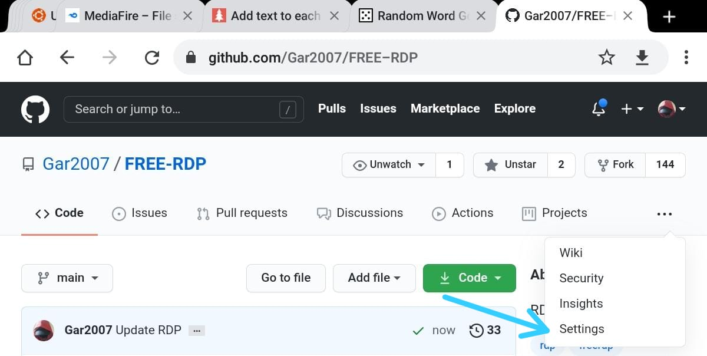
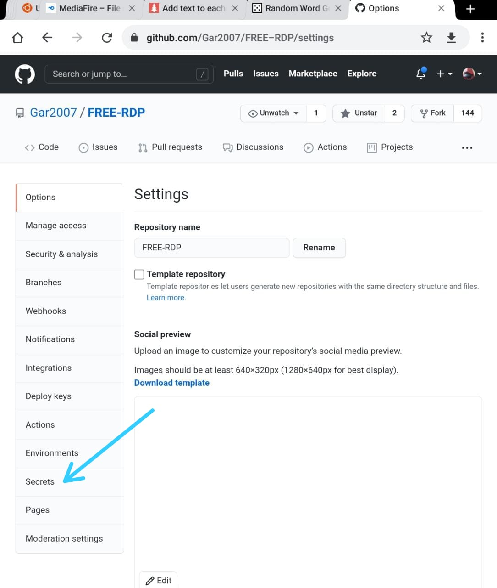
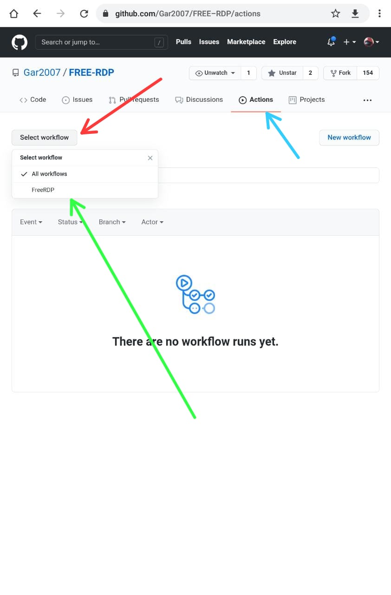
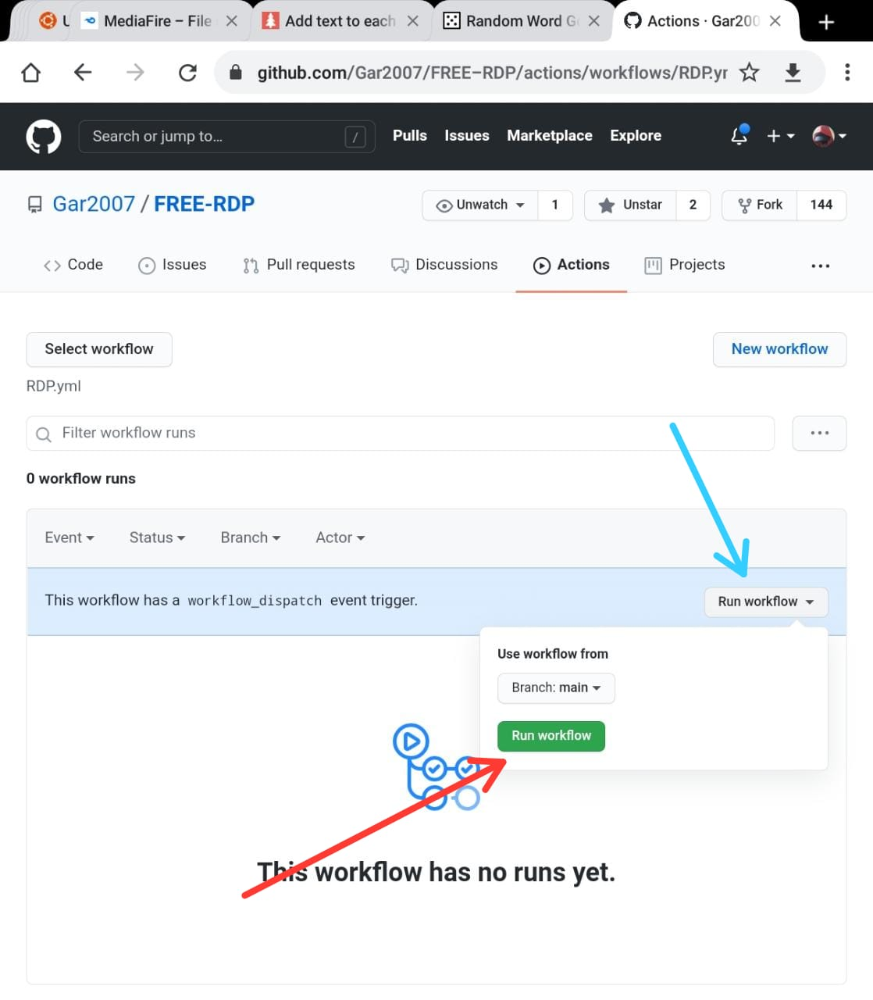
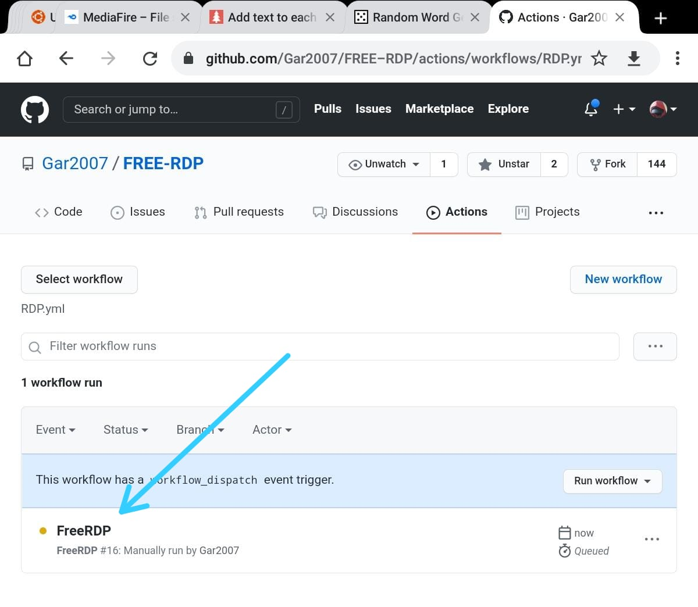
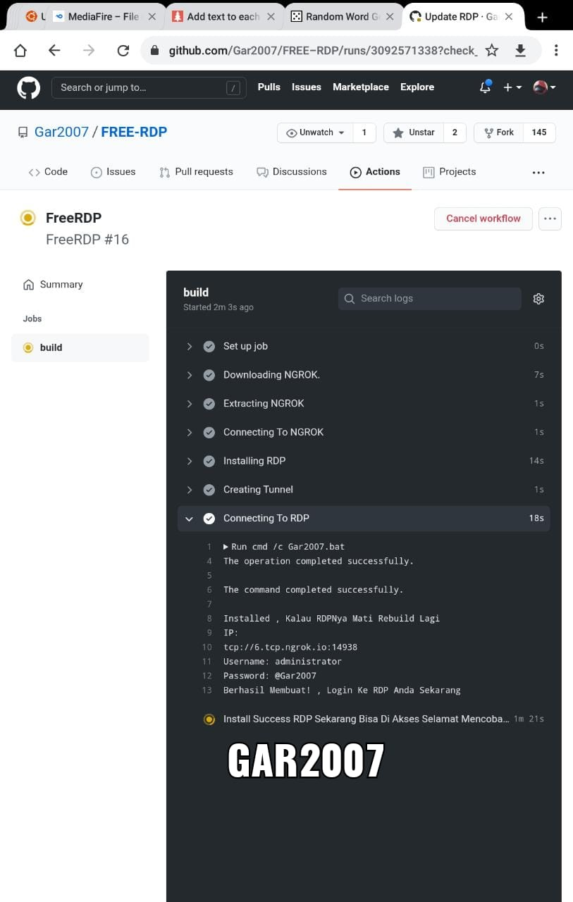

# FREE-RDP

## Step

+ Daftar Akun Github , Pastikan Akun Tidak "Flagged"
> Register Github Account , Make Sure Your Account Not "Flagged"

+ Login Dengan Akun Github Kalian Dan Buka https://github.com/Gar2007/FREE-RDP
> Login With Your Github Account And Open This Link https://github.com/Gar2007/FREE-RDP

+ Fork Repo Ini Dengan Menekan Tombol "Fork", Maka Repo Ini Otomatis Tersalin Ke Akun Github Kalian
> Fork This Repo By Click "Fork" Button , So This Repo Automatically Copied To Your Account

+ Buka "https://dashboard.ngrok.com/" (Buat Akun Jika Belum Ada), Ambil *Auth Token* Kalian Di "https://dashboard.ngrok.com/get-started/your-authtoken" Dan Salin
> Open "https://dashboard.ngrok.com/" (Make Account If You Don't Have), Copy Your *Auth Token* At "https://dashboard.ngrok.com/get-started/your-authtoken"

+ Buka Repo Ini Lagi Dan Pergi Ke Settings > Secrets > New Repository Secrets
> Open This Repo Again And Go To Settings > Secrets > New Repository Secrets

+ Isi "Name" Dengan "NGROK_TOKEN"
> Fill "Name" With "NGROK_TOKEN"

+ Isi "Value" Dengan *Auth Token* Yang Disalin Tadi , Tekan Add Secret
> Fill "Value" With Your *Auth Token* That Has Copied , Click Add Secret

+ Pergi Ke Actions > Select Workflow > FreeRDP > Run Workflow
> Go To Actions > Select Workflow > FreeRDP > Run Workflow

+ Refresh Web Dan Pilih FreeRDP > Build
> Refresh Web And Choose FreeRDP > Build

+ Dan Selesai! RDP Kalian Sudah Siap, Buka Info Login Kalian
> Done! Your RDP Is Ready For Use, Open Your Login Info

+ Spesifikasi
> Specification

### Rules

+ Jangan Mining!
> Don't Mining!

### Grup Chat

+ Jika Ada Pertanyaan Silahkan Bergabung Ke Grup Chat WhatsApp Kami
> Have Any Question? Join Our Group

https://chat.whatsapp.com/FLR44q2InI63CwsLkiWA3B
